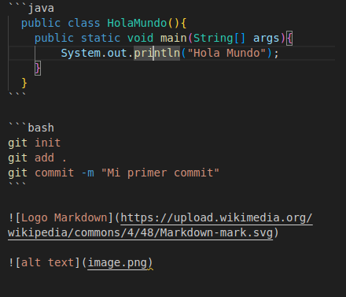
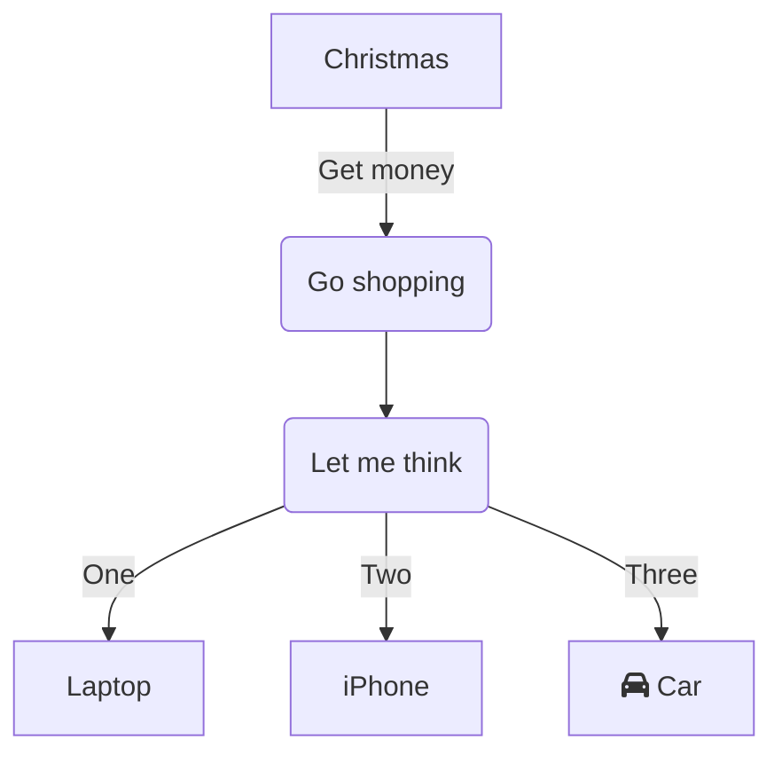

# Página 1

Esta es una nueva página de documentación.

Línea añadida desde rama 'main'.

Añadida línea adicional feature.

## Título nivel 2

### Título nivel 3

Texto bla bla bla.
asdasd

asdadsdasdadas

#### Título nivel 4
##### Título nivel 5
###### Título nivel 6
####### Título nivel 7 (es un párrafo normal, llega hasta nivel 6)

Dentro de este párrafo *esto* está en cursiva, **esto** en negrita, y ***esto*** en cursiva y negrita.

- Esto es una lista ordenada.
- Esto es otro elemente de la lista.
   - Esto es un elemento anidado. <!--Pulsar TAB -->
     - Esto es un elemento anidado nivel 3.
- Este es otro elemento más.
  
  1. Lista numerada, item 1.
     1. - 
  2. Lista numerada, item 2.
  3. Lista numerada, item 3.
     1. Sub-elemento 1.
     2. Sub-elemento 2.
        1. Sub-sub num.
           1. Sub-sub-sub num.
              1. Sub-sub-sub-sub num.
- [ ] Tarea 1.
- [X] Tarea realizada.
  > Esto es una cita.
  > > Cita aninada.
  >
  > Una cita no tiene que estar en una sola línea,puede estar formada por más de una.
  > - Lista dentro de cita.
  > - Otro elemento.
  
  Para inicializar un repo de git usamos `git init`.

  El siguiente fragmento de código Java:

```java
  public class HolaMundo(){
    public static void main(String[] args){
        System.out.println("Hola Mundo");
    }
  }
```

```bash
git init
git add .
git commit -m "Mi primer commit"
```




[Página Main](#paginamain.md)

[Titulo principal](#pagina1.md)

[Markdown Guide][1]

[1]: https://www.markdownguide.org

:smile:
:lobster:

Para poder ver en negrita debemos escribir \*\*negrita\*\*

Para poder ver en cursiva debemos escribir \*cursiva\*

Para poder ver en negrita y cursivadebemos escribir \*\*\*negrita y cursiva\*\*\*

Para representar símbolos: 

| Encabezado 1 | Encabezado 2 | Encabezado 3 | Encabezado 4 | Encabezado 5 |
| :---: | :---: | :---: | :---: | :---: |
|Celda 11|Celda 12|Celda 13|Celda 14|Celda 15|
|Celda 21<br>Celda 21|Celda 22|Celda 23|Celda 24|Celda 25|

Diagramas:



Fórmula de la relatividad: $E_i=mc^2$
Fórmula de la gravedad:
$$F = G\frac{m_1 m_2}{r²}$$